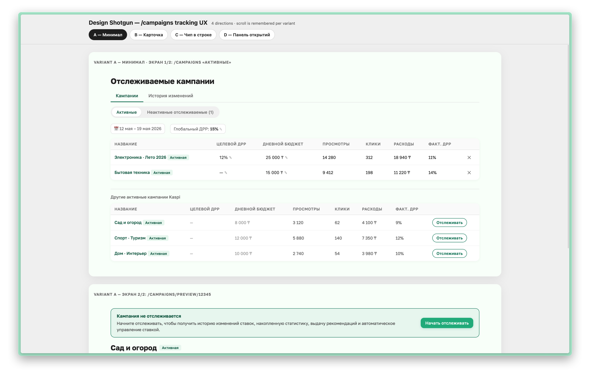

# design-html-shotgun

A Claude Code skill that generates **multiple full-fidelity static HTML mockups** for a screen and serves them through a tabbed iframe board with per-variant scroll memory.



Each variant is a standalone HTML page styled with your project's existing CSS tokens. The framework — sticky tab bar, iframe slot, and scroll-position memory — is reused across sessions and ships once with the skill.

## Why this exists

When you're exploring UI directions, the cycle is:

1. Ask Claude for "3 variants of this screen"
2. Get them as separate code blocks or files
3. Lose track of which is which while scrolling
4. Forget your scroll position when switching back

This skill solves all four. One board, four tabs, scroll memory baked in.

For interactive React/Svelte previews use `/design-shotgun`. For finalized production HTML use `/design-html`. This skill is for the **rapid static exploration step** in between.

## Install

Clone into `~/.claude/skills/`:

```bash
cd ~/.claude/skills
git clone https://github.com/oitan/design-html-shotgun.git
```

Restart Claude Code so it picks up the new skill, or check with:

```bash
ls ~/.claude/skills/design-html-shotgun/SKILL.md
```

## Use

In Claude Code:

```
/design-html-shotgun
```

Or natural language:

> "Shotgun me 4 directions on the campaigns list page."

The skill will:

1. Detect your project's CSS tokens (reads `app/globals.css`, `globals.css`, `styles/globals.css`, or asks).
2. Ask scope: which screen, how many variants, language.
3. Brainstorm N distinct concepts and let you approve them.
4. Generate `~/.gstack/projects/$SLUG/designs/$NAME-$DATE/` with one `variant-X.html` per concept, a `manifest.js`, and a copy of the framework.
5. Open the board in your browser.

## How the board works

```
┌──────────────────────────────────────────────────────┐
│  Design Shotgun — /campaigns tracking UX             │  ← sticky bar
│  [A — Minimal] [B — Card] [C — Chip] [D — Discovery] │  ← tabs
├──────────────────────────────────────────────────────┤
│                                                      │
│           (iframe loads variant-A.html)              │  ← scrollable
│                                                      │
│           scroll position saved per variant          │
│                                                      │
└──────────────────────────────────────────────────────┘
```

- Click a tab → swap `iframe.src` to that variant's file.
- Scroll inside the iframe → position saved to `sessionStorage` keyed by variant id.
- Switch tabs, scroll, switch back → restored exactly.
- Refresh the page → still restored.

## Manifest format

Each session writes a `manifest.js` like:

```js
window.DS_MANIFEST = {
  id: "campaigns-tracking-20260519",  // namespaces sessionStorage
  title: "Design Shotgun — /campaigns tracking UX",
  subtitle: "4 directions · scroll is remembered per variant",
  variants: [
    { id: "A", label: "A — Minimal",     file: "variant-A.html" },
    { id: "B", label: "B — Card",        file: "variant-B.html" },
    { id: "C", label: "C — Inline chip", file: "variant-C.html" },
    { id: "D", label: "D — Discovery",   file: "variant-D.html" }
  ]
};
```

To add a variant after the fact: write a new `variant-E.html` next to the others, append `{ id: "E", label: "E — Whatever", file: "variant-E.html" }` to `variants`, reload the board.

## Files

```
design-html-shotgun/
├── SKILL.md                  Claude Code skill instructions
├── README.md                 this file
├── LICENSE                   MIT
└── framework/
    ├── framework.html        sticky tab bar + iframe slot
    ├── framework.css         minimal project-agnostic styling
    └── framework.js          tab logic + per-variant scroll memory
```

The `framework/` dir is copied into each session output dir, so each design board is self-contained and shareable (zip it, send it, deploy it static).

## Constraints

- Browser must allow same-origin iframe access for `file://` URLs in the same directory (Chrome, Safari, Firefox all do by default).
- Variant pages should be self-contained: inline `<style>`, no external JS bundles. Google Fonts `<link>` is fine.
- Scroll memory uses `sessionStorage`, not `localStorage` — it survives reloads in the same tab but not browser restarts. That's intentional: each shotgun is a focused session.

## Example

A real four-variant shotgun for a marketplace campaigns page lives in `example/` — open `example/index.html` to see the framework in action.

## License

MIT — see `LICENSE`.
