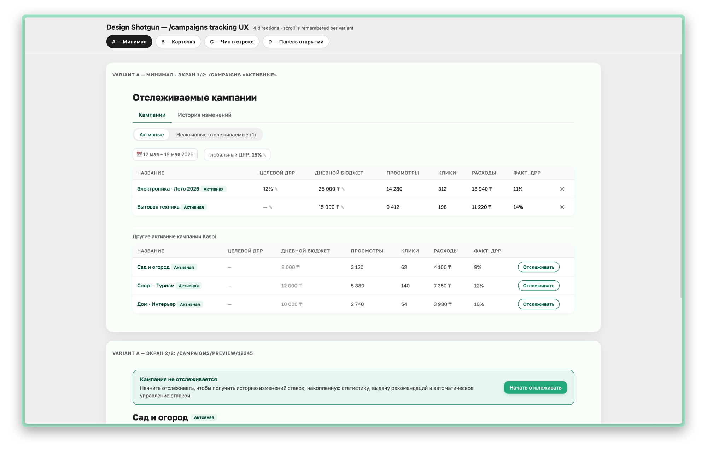

# design-html-shotgun

Claude Code skill for generating design variants and comparing them side-by-side.



Each variant is a standalone HTML page styled with your project's existing CSS tokens. The framework — sticky tab bar, iframe slot, and scroll-position memory — is reused across sessions and ships once with the skill.

## Why this exists

When you're exploring UI directions, the cycle is:

1. Ask Claude for "3 variants of this screen"
2. Get them as separate code blocks or files
3. Lose track of which is which while scrolling
4. Forget your scroll position when switching back

This skill solves all four. One board, four tabs, scroll memory baked in.

For AI-image variants use gstack's `/design-shotgun`; for finalized production HTML use gstack's `/design-html`. This skill is for the **rapid static exploration step** before them. The handoff needs [gstack](https://github.com/garrytan/gstack) installed; the skill checks and offers the install command if it's missing.

## Install

With the [`skills`](https://github.com/vercel-labs/skills) CLI, globally for Claude Code:

```bash
npx skills add oitan/design-html-shotgun -g -a claude-code -y
```

Restart Claude Code so it picks up the new skill.

## Update

```bash
npx skills update design-html-shotgun -g
```

Pulls the latest push of this repo. To change the skill: edit here, push, run the update on each machine.

## Use

In Claude Code:

```
/design-html-shotgun
```

Or natural language:

> "Shotgun me 4 directions on the campaigns list page."

The skill will:

1. Read `DESIGN.md` / `PRODUCT.md` and your CSS tokens (`app/globals.css`, `globals.css`, `styles/globals.css`, Tailwind config), or ask.
2. Ask scope: screen, who and what job, edge cases, how many variants, language.
3. Brainstorm N distinct concepts and let you approve them (two rounds at most).
4. Generate `~/.design-shotgun/$SLUG/$NAME-$DATE/` with one `variant-X.html` per concept, a `manifest.js`, and a copy of the framework. Files are never overwritten: revisions get new ids (`A2`).
5. Serve the board on `127.0.0.1` and open it in your browser.
6. Check each variant at 375 / 768 / 1440 if a browser automation tool is available.
7. Iterate with targeted edits, then record the winner in `approved.json`.

Every variant follows [`references/design-rules.md`](references/design-rules.md): anti-convergence, an AI-slop blacklist, UX behavior rules, edge cases, a craft baseline.

## How the board works

```
┌──────────────────────────────────────────────────────┐
│  Design Shotgun — /campaigns tracking UX             │  ← sticky bar
│  [A — Minimal] [B — Card] [C — Chip] [D — Discovery] │  ← tabs
├──────────────────────────────────────────────────────┤
│                                                      │
│           (iframe loads variant-A.html)              │  ← scrollable
│                                                      │
│           scroll position saved per variant          │
│                                                      │
└──────────────────────────────────────────────────────┘
```

- Click a tab → swap `iframe.src` to that variant's file.
- Scroll inside the iframe → position saved to `sessionStorage` keyed by variant id.
- Switch tabs, scroll, switch back → restored exactly.
- Refresh the page → still restored.

## Manifest format

Each session writes a `manifest.js` like:

```js
window.DS_MANIFEST = {
  id: "campaigns-tracking-20260519",  // namespaces sessionStorage
  title: "Design Shotgun — /campaigns tracking UX",
  subtitle: "4 directions · scroll is remembered per variant",
  variants: [
    { id: "A", label: "A — Minimal",     file: "variant-A.html" },
    { id: "B", label: "B — Card",        file: "variant-B.html" },
    { id: "C", label: "C — Inline chip", file: "variant-C.html" },
    { id: "D", label: "D — Discovery",   file: "variant-D.html" }
  ]
};
```

To add a variant after the fact: write a new `variant-E.html` next to the others, append `{ id: "E", label: "E — Whatever", file: "variant-E.html" }` to `variants`, reload the board.

## Files

```
design-html-shotgun/
├── SKILL.md                  Claude Code skill instructions
├── README.md                 this file
├── LICENSE                   MIT
├── references/
│   └── design-rules.md       rules every variant follows
└── framework/
    ├── framework.html        sticky tab bar + iframe slot
    ├── framework.css         minimal project-agnostic styling
    └── framework.js          tab logic + per-variant scroll memory
```

The `framework/` dir is copied into each session output dir, so each design board is self-contained and shareable (zip it, send it, deploy it static).

## Constraints

- Serve the board over HTTP (the skill does: `python3 -m http.server`). Chrome and Firefox give every `file://` page its own origin, so scroll memory can't read the iframe there; the board says so when opened as a file.
- Variant pages should be self-contained: inline `<style>`, no external JS bundles. Google Fonts `<link>` is fine.
- Scroll memory uses `sessionStorage`, not `localStorage` — it survives reloads in the same tab but not browser restarts. That's intentional: each shotgun is a focused session.

## Example

A real four-variant shotgun for a marketplace campaigns page lives in `example/` — open `example/index.html` to see the framework in action.

## License

MIT — see `LICENSE`. `references/design-rules.md` is adapted from [gstack](https://github.com/garrytan/gstack) (MIT, Copyright (c) 2026 Garry Tan).
